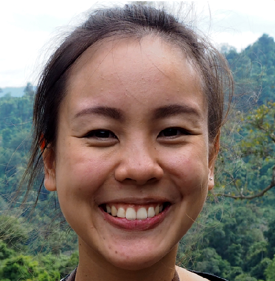

# Face-Image-Colorization

In this repository, we provide Generative Models to adress the **Image Colorization** problem.

The generative network is given a 512x512 input image in the B&W domain and generates the corresponding 512x512 image in the RGB domain.

We followed **two approaches**, the first one is in a **supervised** way where we trained a [colorization GAN](/model/colorization_gan.py), where the loss is computed by comparing the output of the generative network with the ground truth.

The other approache is **unsupervised**, where we trained a [cycle GAN](/model/cycle_gan.py) as proposed in the original paper https://arxiv.org/pdf/1703.10593.pdf but we omitted the use of the identity loss as the images of the two generators don't have the same output channels. 

**P.S.1**: feel free to comment and contribute to this modest work ;-)

**P.S.2**: pretrained models will be added soon (-:
